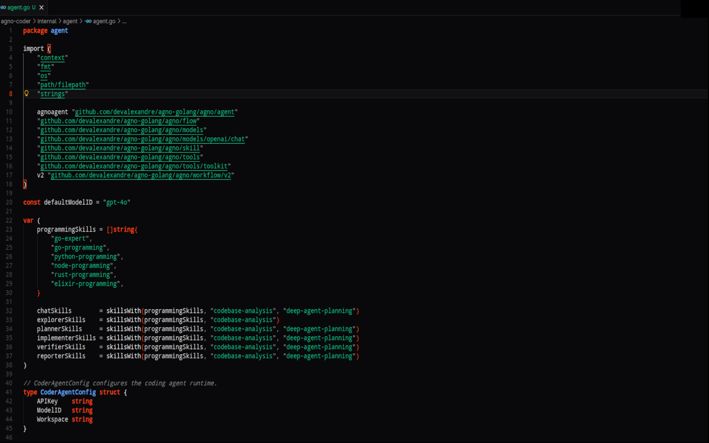
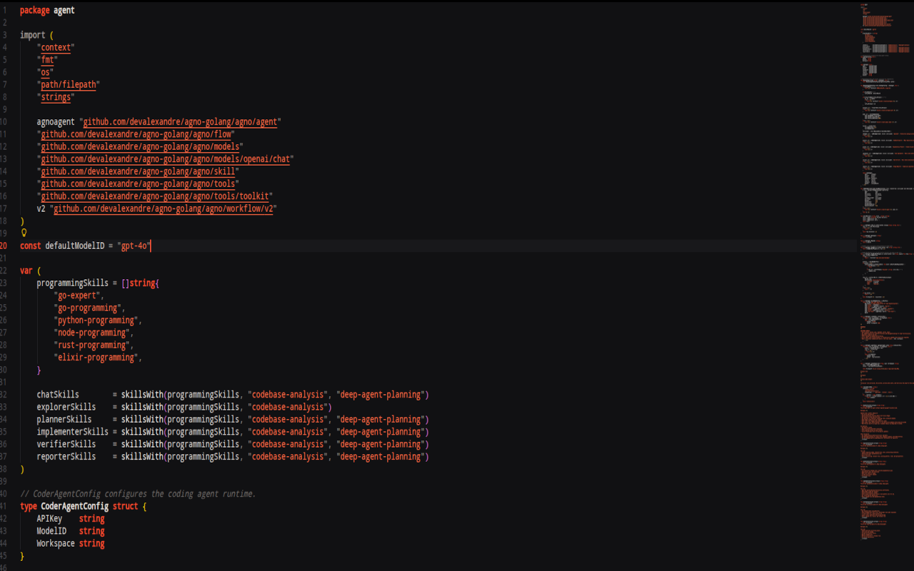
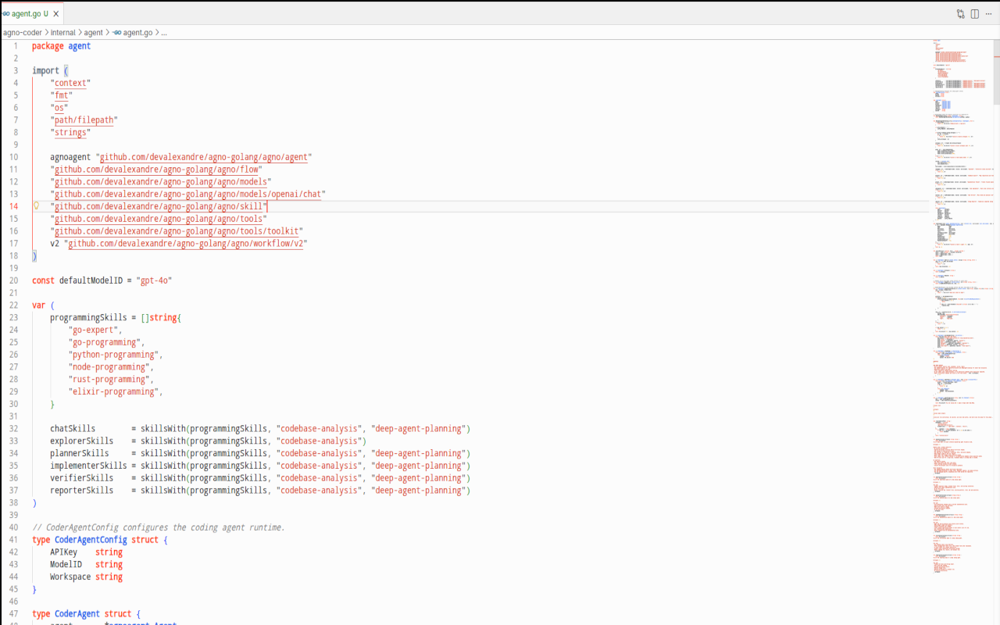
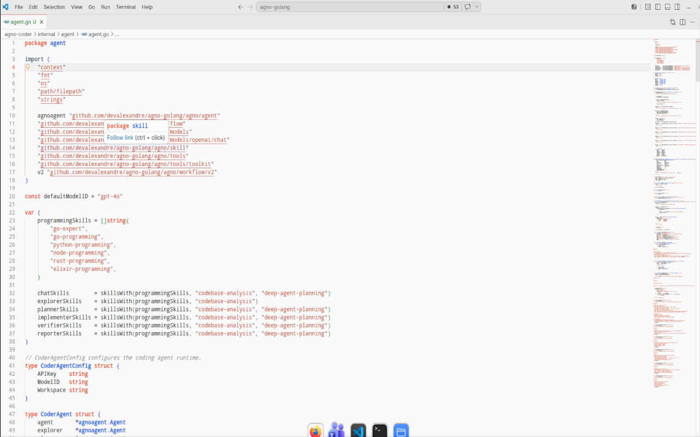
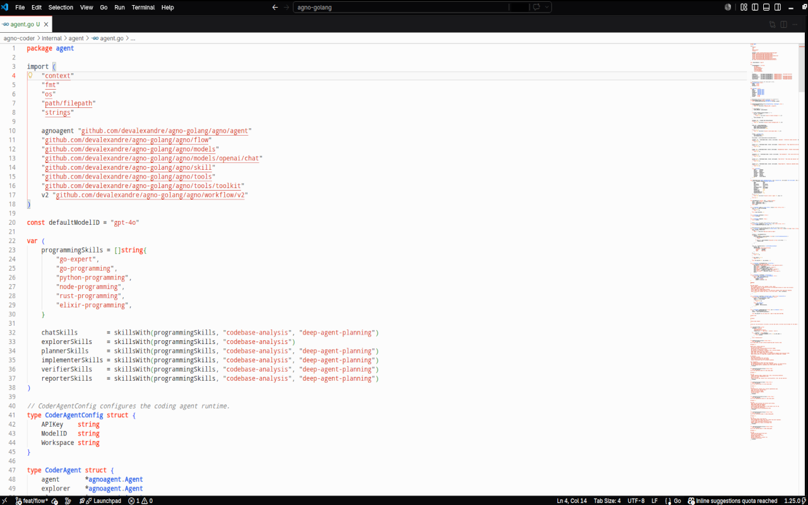

# Agno Theme

A focused VS Code theme family inspired by Agno's official palette: graphite surfaces, clean light neutrals, crisp orange accents, and calm syntax colors for long coding sessions.



## Themes

- **Agno One Dark**: a deeper graphite variant with richer syntax contrast.
- **Agno Dark**: the original dark theme with warm Agno accents.
- **Agno Light**: a clean light theme based on Agno's paper-like neutrals.
- **Agno Light Soft**: a softer light variant for long sessions.
- **Agno Light Graphite**: a light editor framed by a graphite workbench.

## Screenshots

### Agno One Dark


### Agno Dark



### Agno Light



### Agno Light Soft



### Agno Light Graphite



## Installation

Install the extension, open the Command Palette, and run:

```text
Preferences: Color Theme
```

Then select one of the Agno themes.

You can also install a local VSIX:

```bash
code --install-extension agno-dark-theme-0.0.5.vsix
```

## Palette

The themes are built around Agno's public color language:

- Graphite: `#09090B`, `#18181B`, `#202020`, `#262628`
- Neutrals: `#F0F0F0`, `#E8E8E8`, `#D9D9D9`, `#BBBBBB`, `#8D8D8D`
- Accent: `#FF4017`, `#F25837`, `#EB6E52`
- Syntax helpers: `#60A5FA`, `#10B981`, `#FBBF24`, `#F87171`

## Repository

The full theme pack also includes ports for Zed, JetBrains IDEs, Sublime Text, Vim, and Neovim:

https://github.com/devalexandre/agno-theme

## Feedback

Issues and suggestions are welcome:

https://github.com/devalexandre/agno-theme/issues
